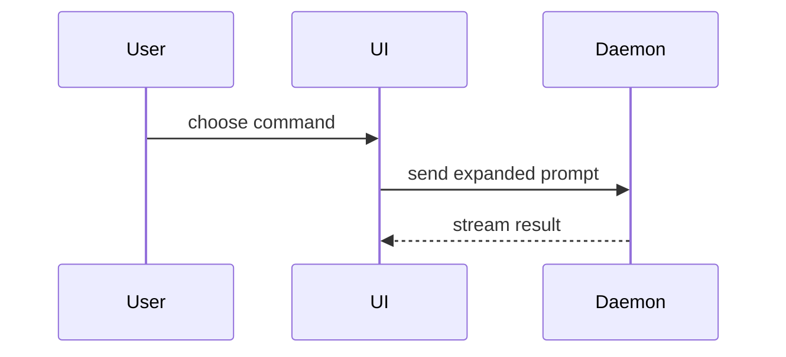

PR 本文は次のテンプレートで書く:

```markdown
## Summary

<図、diff スケッチ、またはツリー>

## Evidence

- **Before:** <スクリーンショット / 出力 / 失敗するテストの実行結果>
  **After:** <スクリーンショット / 出力 / 通るテストの実行結果>

## Merge Danger

**Door:** <two-way（戻せる）か one-way（戻せない）か>

<任意: 説明>

**Blast Radius:** <一語で>

<任意: マージで起こりうる影響>
```

## 各節

前置きは書かず、文章は短くする。用語は新しく作らず、そのリポジトリのコードやドキュメントで既に使っている語を使う。

### Summary

要点が伝わる最小の見せ方を選ぶ。

- ロジックやアルゴリズムは疑似コードで見せる:

```text
on(save)
  if content is unchanged
    return cached result
  write new content
  return fresh result
```

- 実行時の制御の流れは呼び出しツリーで見せる:

```text
submitForm
  createSession
    persistPrompt
    launchAgent
  navigateToSession
```

- UI の構造はコンポーネントツリーで見せる。意味のある state やモジュールの境界も含める:

```text
<SessionPage> (apps/example/src/routes/session.tsx)
  useSessionEvents()
  <SessionToolbar>
    <RunSkillButton> (packages/ui)
```

- ファイルの責務や広範囲のリファクタは、浅いファイルツリーで見せる:

```text
src/
├── commands/       # parses user actions
├── sessions/       # owns session state
└── transport/      # sends API requests
```

- コンポーネント間のやり取り、制御の流れ、データの流れは Mermaid で見せる:



- 周りの形が既にあって、要点が「何が変わるか」の時は `diff` を使う。diff の形は話題に合わせる。

コンポーネントの変更:

```diff
 <SessionPage>
   useSessionEvents()
   <SessionToolbar>
+    <RunSkillButton />
   <SessionTimeline>
+    <SkillResultCard />
```

ファイル配置の変更:

```diff
 src/
 ├── commands/
+│   └── show-me.ts       # expands the slash command
 ├── sessions/
-└── transport.ts
+└── transport/
+    ├── client.ts
+    └── stream.ts
```

呼び出しツリーやコールスタックの変更:

```diff
 submitForm
   createSession
     persistPrompt
+    expandSkillMention
     launchAgent
-  navigateToSession
+  navigateToSession
+    subscribeToEvents
```

state や制御の流れの変更:

```diff
 on(save)
-  write content
+  if content is unchanged
+    return cached result
+  write new content
+  invalidate cache
```

- ブロックの大半が新規の時、省くと所有関係や順序が見えなくなる時、読み手がそのまま写せる完成形が要る時は、ブロック全体を見せる:

```ts
function expandSkill(command: string): string {
  const skillName = command.slice(1);
  return `use the ${skillName} skill`;
}
```

#### 指針

図はそれが支える短い文のすぐ隣に置く。残すのは、読み手の今の問いに答えるため、または今の論点を決着させる選択肢を示すために要る呼び出し・ファイル・props・state・境界だけにする。

使うのは 1 つでも、いくつかでもよい。全部使うことはまず無い。判断して選び、読み手を圧倒しない。

### Evidence

変更が動くことの具体的な証拠。Before と After を見せる。

スクリーンショットが最上位。環境が整っていて、見た目の変わる変更の時に使う。

実行に基づく証拠がその次。テスト結果やコンソール出力。今は失敗して変更後に通るテストを、疑似コードで正確に示す。

### Merge Danger

one-way door か two-way door かを書く。two-way door は引き返せるが、one-way door は引き返せない。ロールバックが安い PR ほどリスクは低い。破壊的な操作や、戻しにくい決定を含む変更は one-way door になる。

blast radius は、この PR の変更が及びうる影響の範囲。あらゆる可能性を考える。例えば、レイアウトのずれ、利用側の破損、モバイルでのレスポンシブ表示など。
